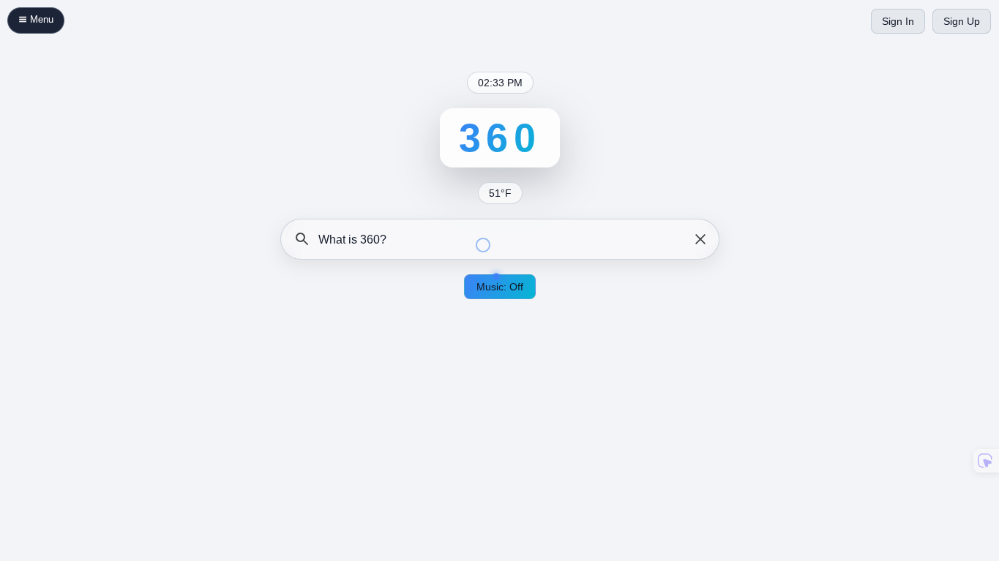
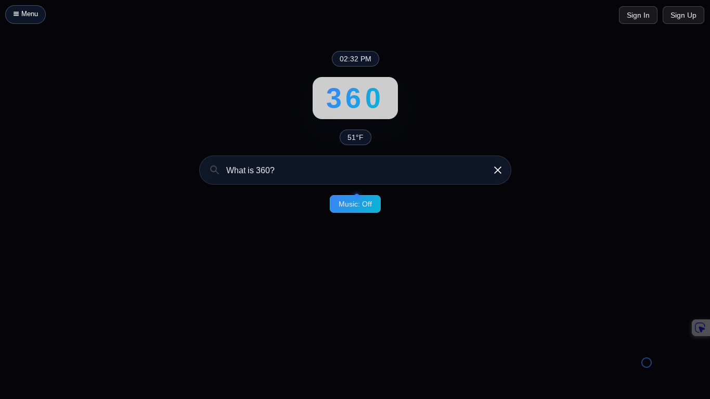

# 360


A multi-tool browser and search engine.
Our Reddit: https://www.reddit.com/r/360Search/

360 is a multi-tool browser (search engine) that has more tools to outperform any browser through conveniently organized UIs — so your work doesn't need to be done on 50+ tabs.

With many search engines and browsers losing trust from core users, this is a great opportunity to switch to a fully private, fully open source search engine. Using 360 supports 360 Digital, Co. and every contribution counts. Switch to 360 now! (if you want — we're humble and will not be pushy)

---

## Features

- 🔍 **Search** — Private, fast search
- 🤖 **AI** — Built-in AI assistant with conversation history and file uploads
- 💬 **Chat** — Real-time global chat with communities, DMs, reactions and moderation
- 📰 **News** — Live news feed across multiple categories
- 🎮 **Games** — Built-in games including Space Glider, StarBlasted and NYC Dream
- 🌦️ **Weather** — Live weather with map view
- 📈 **Stocks** — Real-time stock quotes
- 🌍 **Translator** — Translate between 80+ languages
- 🔗 **URL Shortener** — Shorten any link instantly
- 🎨 **Themes** — 6 color themes, dark mode, and custom cursor styles
- 🖥️ **Desktop App** — Native app for Windows and Linux

---

## Installation

### Web
Just visit [360-search.com](https://360-search.com) — no install needed.

### Windows
1. Download `360 Setup 2.0.1.exe` from [Releases](https://github.com/360-By-360Digital/360/releases)
2. Double click and it installs silently
3. 360 launches automatically when done

### Linux (Ubuntu/Debian/Zorin/Mint/Pop!_OS)
1. Download `360-desktop_2.0.1_amd64.deb` from [Releases](https://github.com/360-By-360Digital/360/releases)
2. Run:
```bash
sudo dpkg -i 360-desktop_2.0.1_amd64.deb
```
Or install gdebi for double-click install:
```bash
sudo apt install gdebi -y
```

### Android
Coming soon via Samsung Galaxy Store.

---

## Roadmap

- [x] Web app
- [x] Windows desktop app
- [x] Linux desktop app
- [ ] Mac desktop app
- [ ] Android app (Samsung Galaxy Store)
- [ ] Edge / Opera browser extension
- [ ] PWA improvements

---

## Releases

<a href="https://github.com/360-By-360Digital/360/releases/tag/V.2.0.1">Release V.2.0.1</a>

<a href="https://github.com/360-By-360Digital/360/releases/tag/V.2.0.2">Release V.2.0.1 — Windows .exe (unstable)</a>

<a href="https://github.com/360-By-360Digital/360/releases/tag/V.2.0.3">Release V.2.0.2 — Windows .exe (stable)</a>

<a href="https://github.com/360-By-360Digital/360/releases/tag/V.2.0.4">Release V.2.0.2 — Linux .deb (stable)</a>

---

## Email Us

Help: help@360-search.com

Admin: admin@360-search.com

Support: mingze@360-search.com

Support: zakii@360-search.com

---

## Screenshots

### Light Mode


### Dark Mode


### Settings


The rest is for you to find out :) Enjoy 360!!

© 2026 360 Digital, Co.
